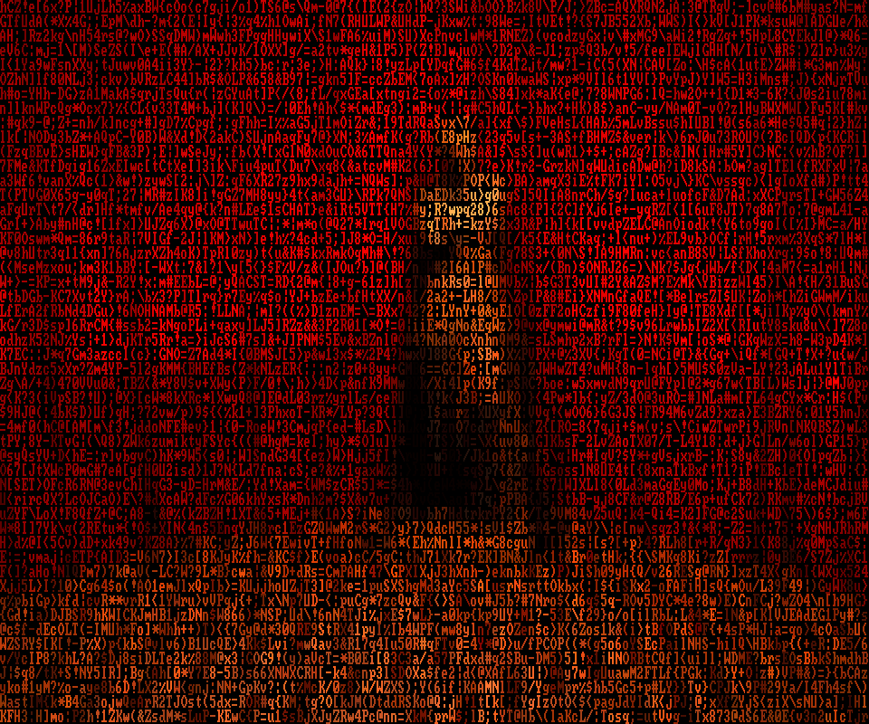

# cpeaks

> *"Through the darkness of future past, the magician longs to see. One chants
> out between two worlds: Fire, walk with me."*

A Twin Peaks **Red Room** themed Matrix-rain for your terminal.

cpeaks is a loving homage to [**cmatrix**](https://github.com/abishekvashok/cmatrix)
— the wonderful terminal Matrix-rain originally written by **Chris Allegretta**
(author of GNU nano) and maintained and improved for years by **Abishek V Ashok**.
cpeaks exists only because their project is so good; all we did was point its
falling-character magic at the Red Room. If you enjoy this, please go star
[cmatrix](https://github.com/abishekvashok/cmatrix) — that's the original, and
the one that deserves the credit. 🌹

Run `cpeaks` and the iconic Red Room **fades up out of black** as an ASCII
glyph-mosaic — the Venus de Milo statue framed against red curtains and the
black-and-white chevron floor — with the **curtains already drifting slowly as
if in a warm breeze** the whole time it appears. Press any key to leave.



*An actual render of the settled frame (120×50) — colour-on-black glyphs, exactly
as it appears in the terminal. Larger terminals give a sharper statue.*

## How it works

- **The statue is the hero.** Framing is anchored on the statue's focal point
  and scaled so it stays centred and fully visible regardless of your terminal's
  aspect ratio. Wide terminals show more curtain to the sides; tall ones trim
  the outer drapes — the statue never moves.
- **Faithful colour.** The reference photo is embedded in the binary and
  quantized (median-cut) to a bespoke 240-colour palette derived from the image
  itself. On terminals that allow palette redefinition (most modern ones, via
  ncurses + `initc`), those exact colours are loaded; otherwise it falls back to
  the nearest xterm-256 colours.
- **Every cell is a character.** Like cmatrix, the picture is made of glyphs —
  colour carries the image, the letters keep the Matrix soul.
- **Fade from black → drift.** The image fades up out of darkness while the
  curtains are already drifting, so it arrives in motion rather than snapping
  into place; then the warm-breeze shimmer continues for as long as you watch.

## Build

Requires a C compiler and ncurses.

```sh
make
./cpeaks
```

Install to `/usr/local/bin`:

```sh
sudo make install
```

## Usage

```
cpeaks [options]
  -u N    update delay / speed divisor (1-10, default 3; higher = slower)
  -a F    cell aspect ratio (height/width, default 2.0)
  -n      no curtain drift (settle and hold)
  -h      help
  -V      version
```

Press **any key** while running to exit (screensaver behaviour).

### Verification / debug

```
cpeaks --snapshot out.png [W H]   # render the settled mosaic to a PNG
cpeaks --regions  out.png [W H]   # render the drift region map (debug)
```

These let you preview the framing and colour exactly as the animation will
settle, without watching a live terminal.

## Homage & credits

First and foremost, **thank you to the cmatrix project and its authors.**

- [**cmatrix**](https://github.com/abishekvashok/cmatrix) — the original, and the
  reason cpeaks exists. Created by **Chris Allegretta** and maintained/improved
  by **Abishek V Ashok** and its many contributors. cpeaks is a respectful,
  unaffiliated tribute to their work; please support and star the original.
- Image decoding/encoding via [stb](https://github.com/nothings/stb)
  (`stb_image.h`, `stb_image_write.h`, public domain).
- *Twin Peaks* is © its respective rights holders; this is an unaffiliated
  fan tribute made out of love for the show.

## License

GPL-3.0, inheriting cmatrix's license.
